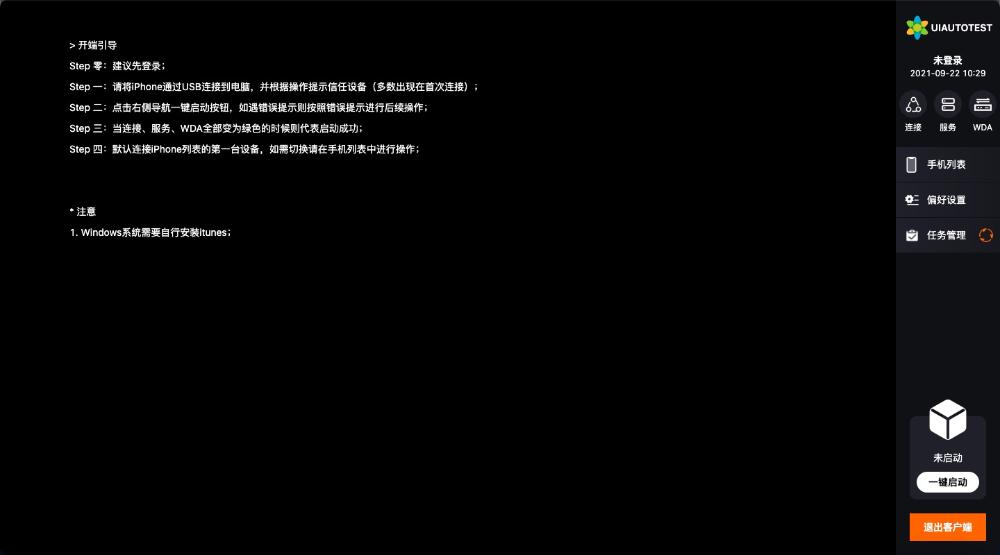
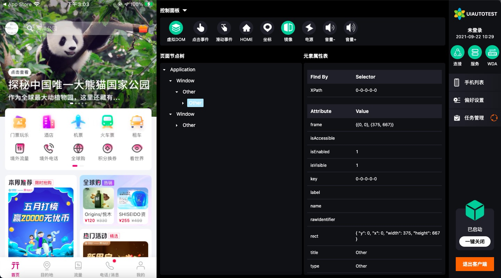

# uiautotest-client

移动端UI测试平台-PC客户端（iOS方向），使用客户端可以链接设备查看页面树，实时页面预览，远程操控设备，辅助编写UI自动化测试用例。

## 开始使用

1、链接一台iOS设备，且设备信任PC；

2、/app/src/api/operationLink.js中打开本地开发环境；

3、/app/src/render/pages/worker/worker.vue中打开本地开发环境；

4、根目录执行如下命令，等待启动客户端：

```shell
npm run electron:serve
```




## 其他命令

全部命令在package.json中的scripts属性中定义，下面列举的是另外两个常用命令

打包.dmg命令：

```shell
electron:build-mac
```

打包.exe命令：

```shell
electron:build-win32
```

